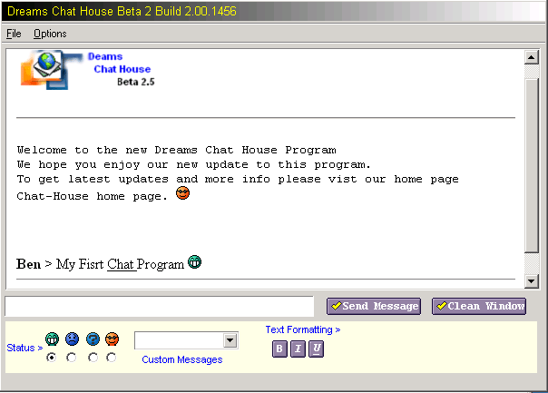



## MY First Chat Program

### Description

Hi This is my first ever chat program on PSC anyway it will allow you multiple connections to the server. and the server will also log the names of the persons that are on the server.

Also the Client uses a HTM Browser control and allow you to use smily faces like the ones on Yahoo use. I have had this program working other the net with a friend so i know it does work. The server it's self does need some big updates but for know it works fine. anyway if you have any ideas or code then feel free to add to the project.

Bye :)
 
### More Info
 

             |
---                |---
**Submitted On**   |2001-04-17 20:08:58
**By**             |[dreamvb](https://github.com/Planet-Source-Code/PSCIndex/blob/master/ByAuthor/dreamvb.md)
**Level**          |Beginner
**User Rating**    |4.8 (29 globes from 6 users)
**Compatibility**  |VB 6\.0
**Category**       |[Internet/ HTML](https://github.com/Planet-Source-Code/PSCIndex/blob/master/ByCategory/internet-html__1-34.md)
**World**          |[Visual Basic](https://github.com/Planet-Source-Code/PSCIndex/blob/master/ByWorld/visual-basic.md)
**Archive File**   |[MY First C184164152001\.zip](https://github.com/Planet-Source-Code/dreamvb-my-first-chat-program__1-22427/archive/master.zip)

